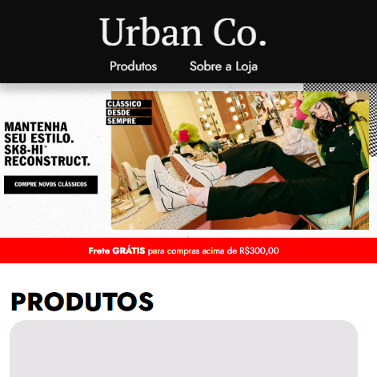

<h1 align="center">
  <p align="center">Página "<a href="https://about-me-v2-nu.vercel.app/" target:"_blank">AboutMe.</a>" versão atualizada</p>
  <a href="https://about-me-v2-nu.vercel.app/" target:"_blank"></a>
</h1>
<div style="display: inline_block"><br>
  <div align="center">
  
  
  </div>
</div>

<h3> Sobre o Projeto </h3>
<p>Esta é a versão 2.0 de um projeto desenvolvido durante o módulo de CSS do curso oferecido pela EBAC, com o objetivo de evoluir a construção individual do aluno. O tema escolhido foi "About Me", e a página web foi criada totalmente sozinho, utilizando apenas HTML5 e CSS3. Além disso, incluí a aba de Projetos onde estão alguns dos projetos que concluí durante o curso da EBAC, um formulário para contato e links de redes sociais. 
Coloquei em prática os estudos de CSS Responsivo, para que assim, o layout se adapte a todos os tipos de resolução.
Para disponibilizar a página online, utilizamos o serviço do site Velcel.com.</p>


<h2><a href="https://about-me-v2-nu.vercel.app/">Acesse aqui a página AboutMe.</a></h2>
<a href="https://site-about-me-orpin.vercel.app/"><b>Acesse aqui a primeira versão</b></a>
<br>
<br>
<br>
<h3>Contatos</h3>
<div style="display: inline_block">
 <a href="https://instagram.com/fde.95" target="_blank"></a>
 <a href = "mailto:fdespinoza95@gmail.com"></a>
 <a href="https://www.linkedin.com/in/fde95" target="_blank"></a> 
</div>
<br>
<br>
<br>
<h3>Código Completo</h3>

<h4>HTML</h4>

```xml
<!DOCTYPE html>
<html lang="pt-br">
<head>
    <meta charset="UTF-8">
    <meta http-equiv="X-UA-Compatible" content="IE=edge">
    <meta name="viewport" content="width=device-width, initial-scale=1.0">
    <link rel="stylesheet" href="./main.css">
    <link rel="preconnect" href="https://fonts.googleapis.com">
    <link rel="preconnect" href="https://fonts.gstatic.com" crossorigin>
    <link href="https://fonts.googleapis.com/css2?family=Jost:wght@400;700&display=swap" rel="stylesheet">
    <title>AboutMe.</title>
</head>
<body>
    <header>
        <div class="container">
        <h1>AboutMe.</h1>
        <nav>
            <ul>
                <li><a href="#home">Home</li></a>
                <li><a href="#about">About</li></a>
                <li><a href="#projects">Projects</li></a>
                <li><a href="#contact">Contact</li></a>
            </ul>
        </div>
        </nav>
    </header>
    <section id="home">
        <div class="container">
            <h2>Felipe Espinoza.</h2>
            <p>Dev Front-End</p>
        </div>
    </section>
    <section id="about">
            <div class="container">
            <h2>About Me</h2>
            <p>Olá! Meu nome é Felipe Espinoza e estou em processo de migração de carreira.<br>
                Após anos atuação no setor marketing em uma multinacional, decidi me dedicar a minha verdadeira  paixão que é programação, mais especificamente em front-end. Com a mudança de carreira, vi a necessidade de me especializar e entender como funciona este mercado, decidi então iniciar uma nova graduação, onde estou cursando Engenharia da Computação na faculdade Descomplica e também sou aluno no curso profissionalizante de engenheiro front-end da EBAC (Escola Britânica de Artes Criativas & Tecnologia). E em fevereiro de 2023 conclui o curso de Figma da própria EBAC, para poder aprimorar ainda as habilidades necessárias dentro do front-end. 
                Este site é um projeto do curso de engenharia front-end da EBAC onde tivemos como desafio, o desenvolvimento desta página para podermos exercitar e aprimorar nossas habilidades em HTML5 e CSS3!</p>
            <br>
                
            </div>
    </section>
<div class="background">
    <div class="container">
        <section id="projects">
            <h2>Projects</h2>
            <div class="products">
                <article class="product">
                    
                    <div>
                        <h3>Urban Co.</h3>
                        <strong>Loja de Calçados Responsiva</strong>
                        <p class="align"><a href="https://github.com/fde95/UrbanCo./blob/main/README.md" target="_blank">Clique aqui e veja o ReadMe no GitHub</a></p>
                    </div>
                    <a href="https://urban-co.vercel.app/" target="_blank"><button>Visitar site</button></a>
                </article>
                <article class="product">
                    
                    <div>
                        <h3>MERCATO MOTORI</h3>
                        <strong>Página de Concessionária</strong>
                        <p class="align"><a href="https://github.com/fde95/MercatoMotori" target="_blank">Clique aqui e veja o ReadMe no GitHub</a></p>
                    </div>
                    <a href="https://mercato-motori-by-felipe-espinoza.vercel.app/" target="_blank"><button>Visitar site</button></a>
                </article>
                <article class="product">
                        
                        <div>
                            <h3>yourNetwork.</h3>
                            <strong>Agenda de Contatos</strong>
                            <p class="align"><a href="https://github.com/fde95/projetoAgendadeContatos" target="_blank">Clique aqui e veja o ReadMe no GitHub</a></p>
                        </div>
                        <a href="https://felipe-projeto-agenda-de-contatos.vercel.app/" target="_blank"><button>Visitar site</button></a>
                </article>
                <article class="product">
                    
                    <div>
                        <h3>Galeria de Fotos</h3>
                        <strong>Uso do jQuery</strong>
                        <p class="align"><a href="https://github.com/fde95/galeriaImagens-jQuery" target="_blank">Clique aqui e veja o ReadMe no GitHub</a></p>
                    </div>
                    <a href="https://fde-galeria-imagens-j-query.vercel.app/" target="_blank"><button>Visitar site</button></a>
                </article>
                <article class="product">
                    
                    <div>
                        <h3>justDo!</h3>
                        <strong>Lista de Tarefas</strong>
                        <p class="align"><a href="https://github.com/fde95/listaTarefas" target="_blank">Clique aqui e veja o ReadMe no GitHub</a></p>
                    </div>
                    <a href="https://fde-lista-tarefas.vercel.app/" target="_blank"><button>Visitar site</button></a>
                </article>
                <article class="product">
                    
                    <div>
                        <h3>Aprova||Reprova</h3>
                        <strong>Calculadora de Médias</strong>
                        <p class="align"><a href="https://github.com/fde95/projetoCalculadoraMedias" target="_blank">Clique aqui e veja o ReadMe no GitHub</a></p>
                    </div>
                    <a href="https://felipe-projeto-calculadora-medias-two.vercel.app/" target="_blank"><button>Visitar site</button></a>
                </article>
                <article class="product">
                    
                    <div>
                        <h3>GAME SHOP</h3>
                        <strong>Página para Loja de Games</strong>
                        <p class="align"><a href="https://github.com/fde95/site_gameshop" target="_blank">Clique aqui e veja o ReadMe no GitHub</a></p>
                    </div>
                    <a href="https://site-gameshop-murex-delta.vercel.app/" target="_blank"><button>Visitar site</button></a>
                </article>
                <article class="product">
                    
                    <div>
                        <h3>About Me.v1</h3>
                        <strong>Primeira página</strong>
                        <p class="align"><a href="https://github.com/fde95/site-about-me" target="_blank">Clique aqui e veja o ReadMe no GitHub</a></p>
                    </div>
                    <a href="https://site-about-me-orpin.vercel.app/" target="_blank"><button>Visitar site</button></a>
                </article>
            </div>
        </section>
    </div>
</div>
    <section id="contact">
        <div class="container">
            <h2>Contact</h2>
        </div>
        <br>
        <div class="form">
        <div class="container">
        <p><h3>Fale comigo</h3></p>
            <form action="https://formspree.io/f/meqwrynq" method="post">
                <input type="text" placeholder="Seu nome completo" required autocomplete="off"/>
                <input type="email" placeholder="Seu e-mail" required autocomplete="off"/>
                <input type="tel" placeholder="Telefone (opcional)" />
                <textarea placeholder="Sua mensagem" required autocomplete="off"></textarea>
                <button type="submit">Enviar</button>
                <input type="hidden" name="redirectTo" value="http://127.0.0.1:5500/index.html#contact">
            </form>
        </div>
        </div>
        <div class="container">
            <br><br>
            <div class="social">
                <p><h3>Conecte-se comigo nas redes sociais</h3></p>
                <ul>
                    <li><a href="mailto:fdespinoza95@gmail.com" title="Enviar e-mail" target="_blank"></a></li>
                    <li><a href="https://www.linkedin.com/in/fde95/" title="Conectar via LinkedIn" target="_blank"></a></li>
                    <li><a href="https://github.com/fde95" title="Conectar via GitHub" target="_blank"></a></li>
                    <li><a href="https://www.instagram.com/fde.95/" title="Conectar via Instagram" target="_blank"></a></li>
                </ul>
            </div>
        </div>
    </section>
    <footer> 
        2023 &copy; Criado e Desenvolvido por Felipe Espinoza
    </footer>
</body>
</html>
```


<h4>CSS</h4>

```css
*{  
    margin: 0;
    padding: 0;
    font-family: 'Jost', sans-serif;
    color: white;
}

body{
    background: linear-gradient(239.44deg, #000000 18.53%, rgba(0, 0, 0, 0.9) 79.46%);
    backdrop-filter: blur(4px);
    background-repeat:round;
}

.container{
    max-width: 1280px;
    width: 90%;
    margin: 0 auto;
}

/*Inicio Criação Header*/
header{
    padding: 16px 0;
    position: sticky;
    top: 0;
    background-color: #000000;
}

header h1{
    font-size: 50px;
}

header .container{
    display:flex;
    align-items:center;
    justify-content: space-between;
}

h1, h2{
    font-weight: 700;
}

header nav li{
    display: inline;
    margin: 16px;
    font-size: 20px;
}

header nav li a{
    text-decoration: none;
    color: greenyellow;
}

header nav li a:hover{
    font-weight: 700;
}
/*Fim Criação Header*/

/*Inicio Criação Home*/
#home{
    padding: 250px 0 320px 0;
}

#home h2{
    font-size: 60px;
}

#home p{
    font-size: 30px;
    line-height: 35px;
    color: greenyellow;
}
/*Fim Criação Home*/

/*Inicio Criação About*/
#about {
    padding: 200px 0 0 0;
}

#about h2{
    font-size: 30px;
}

#about p{
    font-size: 20px;
    line-height: 30px;
    text-align: justify;
}

#about img{
    width: 100%;
    border-radius: 20px;
}
/*Fim Criação About*/

/*Inicio Criação Projects*/
.background{
    background-color:greenyellow;;
}

.products div{
    background-color: #313131;
    padding: 10px 0;
    margin: -8px 0;
}

#projects {
    margin-top: -200PX;
    padding: 300px 0 ;
}

#projects h2{
    font-size: 2.2em;
    padding-bottom: 30px;
    color: #000000;;
}

#projects article{
    font-size: 1em;
    border-radius: 20px;
    box-shadow: 10px 10px 10px rgb(0, 0, 0,0.20);
}

article h3{
    padding: 15px 0 5px 10px;
}

article strong{
    font-weight: 200;
    padding-left:  10px;
}

.products{
    display: grid;
    grid-template-columns: repeat(4, 24.75%);
    column-gap: 1%;
    row-gap: 5%;
}

.product img{
    max-width: 100%;
    border-radius: 20px 20px 0 0;
}

.product a{
    text-decoration: none;
    font-size: 1em;
}

.align{
    padding: 20px 0 0 10px;
}

.align:hover{
    text-decoration: underline;
}

.product a button{
    color: #fff;
    font-size: 1.2em;
    padding: 8px
}

#projects article button{
    margin-top: 8px;
    cursor: pointer;
    width: 100%;
    border: none;
    border-radius: 0 0 20px 20px;
    background-color: #000000;
}

#projects article button:hover{
    background-color:  #141414;
}
/*Fim Criação Projects*/

/*Inicio Criação Contact*/
#contact{
    padding: 110px 0 0 0;
}

#contact h2{
        font-size: 30px; 
    }

#contact p{
        font-size: 20px;
        line-height: 30px;
}

#contact img{
    width: 30px;
    margin-right: 12px;
    }

#contact li{
    display: inline;
    align-items: center;
    justify-items: center;
}

form input,
form textarea,
form button{
    display: block;
    width: 100%;
    margin-bottom: 8px;
    padding: 8px;
    color: #000000;
}

form textarea{
    resize: none;
    height: 200px;
}

form button{
    background-color: greenyellow;
    color: black;
    border: none;
    cursor: pointer;
    width: 101.8%;
    border-radius: 0 0 10px 10px;
    font-size: 1em;
}

form button:hover{
    background-color: rgb(143, 211, 40);
    font-weight: 700;
}

.social h3{
    text-align: center;
    color: greenyellow;
    padding: 0 0 16px 0;
}

.social{
    text-align: center;
}
/*Fim Criação Contact*/

footer{
    padding: 16px 0;
    text-align: center;
    color: greenyellow;
}


/*Inicio Dimensionamento em Celular*/
@media screen and (max-width: 767px){
    .container{
        max-width: 90%;
    }
    
    /*Inicio Ajustes Header*/
    html{
        overflow-x:hidden;
    }

    header h1{
        font-size: 50px;
    }
    
    header .container{
        display:block;
        text-align: center;
    }
    
    h1, h2{
        font-weight: 700;
    }
    
    header nav li{
        font-size: 1.2em;
    }
    /*Fim Ajustes Header*/

    /*Inicio Ajustes AboutMe*/
    #about {
        padding: 110px 0 0 0;
    }
    
    #about h2{
        font-size: 2.5em;
    }
    
    #about p{
        font-size: 1em;
        text-align: justify;
    }
    
    #about img{
        width: 100%;
        height: 100%;
        border-radius: 20px;
    }
    /*Fim Ajustes AboutMe*/

    /*Inicio Criação Projects*/
    #projects {
        margin-top: -100PX;
        padding: 200px 0 100px 0;
    }

    #projects article{
        margin-bottom: 30px;
    }

    .product img{
        max-width: 100%;
    }

    .products{
        display: block;
    }

    .product a{
        text-decoration: none;
        font-size: 1em;
        }
    /*Fim Criação Projects*/

    /*Inicio Ajustes Contato*/
    form input,
    form textarea,
    form button{
        display: block;
        width: 95%;
        margin-bottom: 8px;
    }

    form textarea{
        resize: none;
        height: 200px;
    }

    form button{
        background-color: greenyellow;
        color: black;
        border: none;
        cursor: pointer;
        font-weight:bolder;
        width: 99%;
        border-radius: 0 0 10px 10px;
    }

    .social{
        font-size: 1em;
    }
    /*Fim Ajustes Contato*/

    /*Inicio Ajustes Footer*/
    footer {
        font-size: .9em;
    }
    /*Fim Ajustes Footer*/

}
/*Fim Dimensionamento em Celular*/


/*Inicio Dimensionamento em Tablet*/
@media screen and (min-width: 768px) and (max-width: 1022px) {
    .container{
        max-width: 90%;
    }
    
    /*Inicio Ajustes AboutMe*/
    #about {
        padding: 110px 0 0 0;
    }
    
    #about h2{
        font-size: 2.5em;
    }
    
    #about p{
        font-size: 1em;
        text-align: justify;
    }
    
    #about img{
        width: 100%;
        height: 100%;
        border-radius: 20px;
    }
    /*Fim Ajustes AboutMe*/

    /*Inicio Criação Projects*/
.background{
    background-color:greenyellow;;
}

.products div{
    background-color: #313131;
    padding: 10px 0;
    margin: -8px 0;
}

#projects {
    margin-top: -200PX;
    padding: 300px 0 400px 0;
}

#projects h2{
    font-size: 2.2em;
    padding-bottom: 30px;
    color: #000000;;
}

#projects article{
    font-size: 1em;
    border-radius: 20px;
    box-shadow: 10px 10px 10px rgb(0, 0, 0,0.20);
}

article h3{
    padding: 15px 0 5px 10px;
}

article strong{
    font-weight: 200;
    padding-left:  10px;
}

.products{
    display: grid;
    grid-template-columns: repeat(2, 49%);
    column-gap: 1%;
    row-gap: 5%;
}

.product img{
    max-width: 100%;
    border-radius: 20px 20px 0 0;
}

.product a{
    text-decoration: none;
    font-size: 1em;
}

.align{
    padding: 20px 0 0 10px;
}

.align:hover{
    text-decoration: underline;
}

.product a button{
    color: #fff;
    font-size: 1.2em;
    padding: 8px
}

#projects article button{
    margin-top: 8px;
    cursor: pointer;
    width: 100%;
    border: none;
    border-radius: 0 0 20px 20px;
    background-color: #000000;
}

#projects article button:hover{
    background-color:  #141414;
}
/*Fim Criação Projects*/

    /*Inicio Ajustes Contato*/
    form input,
    form textarea,
    form button{
        display: block;
        width: 98%;
        margin-bottom: 8px;
    }

    form textarea{
        resize: none;
        height: 200px;
    }

    form button{
        background-color: greenyellow;
        color: black;
        border: none;
        cursor: pointer;
        font-weight:bolder;
        width: 100%;
        border-radius: 0 0 10px 10px;
    }

    .social{
        font-size: 1em;
    }
    /*Fim Ajustes Contato*/

    /*Inicio Ajustes Footer*/
    footer {
        font-size: .9em;
    }
    /*Fim Ajustes Footer*/
}
/*Fim Dimensionamento em Tablet*/
```
